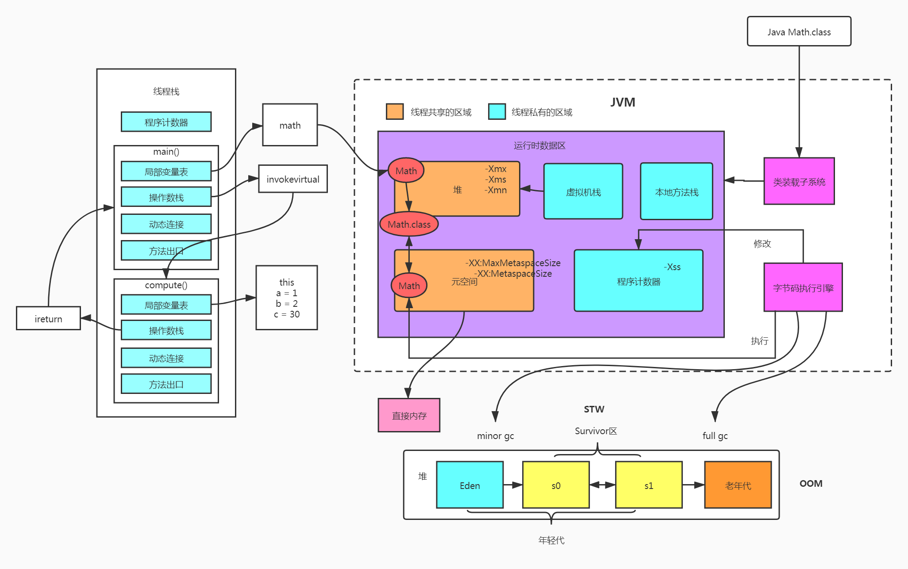

## Java虚拟机的数据区域


## JVM内存参数设置

- `-Xss`：每个线程的栈大小，默认`1m`

- `-Xms`：初始堆大小，默认物理内存的1/64

- `-Xmx`：最大堆大小，默认物理内存的1/4

- `-Xmn`：新生代大小

- `-XX:NewSize`：设置新生代初始大小

- `-XX:NewRatio`：默认2表示新生代占年老代的1/2，占整个堆内存的1/3。

- `-XX:SurvivorRatio`：默认8表示一个survivor区占用1/8的Eden内存，即1/10的新生代内存。

- `-XX:MaxMetaspaceSize`： 设置元空间最大值， 默认是-1， 即不限制， 或者说只受限于本地内存大小。

- `-XX:MetaspaceSize`： 指定元空间触发`full gc`的初始阈值(元空间无固定初始大小)， 以字节为单位，默认是`21M`，达到该值就会触发`full gc`进行类型卸载， 同时收集器会对该值进行调整： 如果释放了大量的空间， 就适当降低该值； 如果释放了很少的空间， 那么在不超过`-XX：MaxMetaspaceSize`（如果设置了的话） 的情况下， 适当提高该值。这个跟早期jdk版本的`-XX:PermSize`参数意思不一样，`-XX:PermSize`代表永久代的初始容量。

> 由于调整元空间的大小需要`Full GC`，这是非常昂贵的操作，如果应用在启动的时候发生大量`Full GC`，通常都是由于永久代或元空间发生了大小调整，基于这种情况，一般建议在`JVM`参数中将`MetaspaceSize`和`MaxMetaspaceSize`设置成一样的值，并设置得比初始值要大，对于`8G`物理内存的机器来说，一般可以将这两个值都设置为`256M`。

## 1. 程序计数器

程序计数器是一块较小的内存空间，它可以看做是当前线程所执行的字节码的行号指示器。
由于Java虚拟机的多线程是通过线程轮流切换、分配处理器执行时间来实现的，如果一个线程在执行一段代码，在执行中间被切换到了其他线程，进入了等待，那当该线程切换回来时，如果确定当前线程执行的位置呢，这时候就是程序计数器发挥作用了，他存储的值可以使得字节码解释器可以得知下一条需要执行的字节码指令。从这里我们也可以知道，每个线程都应该有一个独立的程序计数器，不然要是多个线程共享一个程序计数器的话，那我怎么知道这个要执行的字节码指令是哪个线程的勒。

> 此内存区域是唯一一个在《Java虚拟机规范》中没有规定任务OutOfMemoryError情况的区域
## 2. Java虚拟机栈
和程序计数器一样，Java虚拟机栈也是线程私有的，它的生命周期与线程相同。
虚拟机栈描述的是Java方法执行线程内存模型:每个方法被执行的时候，Java虚拟机都会同步创建一个栈帧。
- 栈帧：Java虚拟机栈所分配的一块内存区域，它里面包含
	- 局部变量表 存放各种基础数据类型，对象引用，returnAddress
	- 操作数栈
	- 动态连接
	- 方法出口
> 每一个方法调用完毕，就对应着一个栈帧在虚拟机栈从入栈到出栈的过程	
> 异常:`StackOverflowError` `OutOfMemoryEroor`
## 3. 本地方法栈
与虚拟机栈相似,一个执行Java方法，一个执行本地方法
## 4. 堆
- 共享情况：所有线程共享
- 创建时间：虚拟机启动时创建
- 存储内容：存放了几乎所有的对象实例
- 扩展性：可扩展，通过参数`-Xmx`和`-Xms`设定
- 异常：`OutOfMemoryError`
> 各个区域的分配，回收的细节在下几篇笔记中记录
## 5.方法区
- 共享情况：所有线程共享
- 创建时间：虚拟机启动时创建
- 存储内容：存储已被虚拟机加载的类信息、常量、静态变量、即使编译器编译后的代码缓存
	- 元空间：主要存储类型信息
	- 运行时常量池：存储类的常量池表
- 参数：`-XX:MetaspaceSize`
- 异常：`OutOfMemoryError`
## 6.直接内存
直接内存并非虚拟机运行时数据区的一部分，它是NIO中，使用Native函数库直接分配的堆外内存，这块内存使用`DirectByteBuffer`进行操作

> 此内存虽不受到Java堆大小的限制，但仍在本机内存中，所以在配置`-Xmx`等参数时不要忽略掉了该内存从而导致`OutOfMemoryError`

## 代码案例

### 安装Visual GC查看运行时内存状态
- 插件地址 https://visualvm.github.io/pluginscenters.html
1. 找到对应jdk版本的插件url 如jdk7：https://visualvm.github.io/archive/uc/8u40/updates.xml.gz
2. 在命令行输入命令`jvisualvm`打开Java VisualVM 
3. 选择工具->插件->设置
4. 编辑Java Visual VM 插件中心配置，修改url为刚才找到的url:https://visualvm.github.io/archive/uc/8u40/updates.xml.gz
5. 在可用插件中选择Visual GC 安装
6. 安装完成，重启，选择java进程时便可看到Visual GC页

###  测试栈溢出

```java
/**
 * 测试栈溢出 -Xss128k 默认为1m
 * @author Zijian Liao
 */
public class StackOverflowTest {
    
    static int count = 0;

    static void redo() {
        count++;
        redo();
    }

    public static void main(String[] args) {
        try {
            redo();
        } catch (Throwable t) {
            t.printStackTrace();
            System.out.println(count);
        }
    }
}
```

### 测试内存参数

```java
/**
 * 测试内存参数 -Xms64m -Xmx64m -Xmn30m -XX:NewRatio=1 -XX:MaxMetaspaceSize=256m -XX:MetaspaceSize=256m
 *
 * @author Zijian Liao
 * @since 1.0
 */
public class MemoryTest {

    static class Memory{
        byte[] bytes = new byte[1024*1024];//1m
    }

    public static void main(String[] args) throws InterruptedException {
        List<Memory> memoryList = new ArrayList<>();
        for(;;){
            memoryList.add(new Memory());
            Thread.sleep(1000);
        }
    }
}
```

