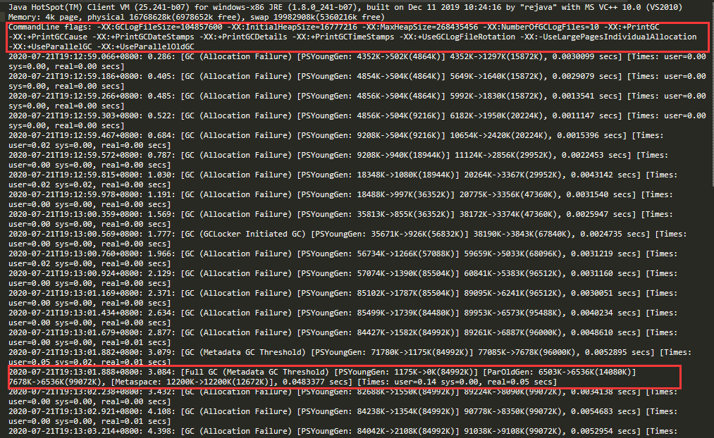

## 使用 Alibaba Arthas(阿尔萨斯)

[官方文档]( https://alibaba.github.io/arthas/)

## GC 日志详解

对于java应用我们可以通过一些配置把程序运行过程中的gc日志全部打印出来，然后分析gc日志得到关键性指标，分析GC原因，调优JVM参数。

打印GC日志方法，在JVM参数里增加参数，%t 代表时间

```shell
-Xloggc:./gc-%t.log -XX:+PrintGCDetails -XX:+PrintGCDateStamps  -XX:+PrintGCTimeStamps -XX:+PrintGCCause -XX:+UseGCLogFileRotation -XX:NumberOfGCLogFiles=10 -XX:GCLogFileSize=100M
```

 Tomcat则直接加在JAVA_OPTS变量里。 

###  **如何分析GC日志** 

 运行程序加上对应gc日志 

```shell
java -jar -Xloggc:./gc-%t.log -Xms512m -Xmx512m -XX:+PrintGCDetails -XX:+PrintGCDateStamps  -XX:+PrintGCTimeStamps -XX:+PrintGCCause -XX:+UseGCLogFileRotation -XX:NumberOfGCLogFiles=10 -XX:GCLogFileSize=100M -XX:+UseParallelGC -XX:+UseParallelOldGC microservice-eureka-server.jar
```

以下是部分日志



我们可以看到图中第一个红框，是项目的配置参数。这里不仅配置了打印GC日志，还有相关的VM内存参数。 

第二个红框中的是在这个GC时间点发生GC之后相关GC情况。

对于**3.084：**  这是从jvm启动开始计算到这次GC经过的时间，前面还有具体的发生时间日期。 

2、Full GC(Metadata GC Threshold)指这是一次full gc，括号里是gc的原因， PSYoungGen是年轻代的GC，ParOldGen是老年代的GC，Metaspace是元空间的GC

3、 1175K->0K(84992K)，这三个数字分别对应GC之前占用年轻代的大小，GC之后年轻代占用，以及整个年轻代的大小。 

4、6503K->6536K(14080K)，这三个数字分别对应GC之前占用老年代的大小，GC之后老年代占用，以及整个老年代的大小。 

5、7678K->6536K(99072K)，这三个数字分别对应GC之前占用堆内存的大小，GC之后堆内存占用，以及整个堆内存的大小。 

6、12200K->12200K(12672K)，这三个数字分别对应GC之前占用元空间内存的大小，GC之后元空间内存占用，以及整个元空间内存的大小。 

7、0.0483377是该时间点GC总耗费时间。  

 **从日志可以发现几次fullgc都是由于元空间不够导致的，所以我们可以将元空间调大点** 

```shell
java -jar -Xloggc:./gc-%t.log -Xms512m -Xmx512m -XX:MetaspaceSize=256M -XX:MaxMetaspaceSize=256M -XX:+PrintGCDetails -XX:+PrintGCDateStamps  -XX:+PrintGCTimeStamps -XX:+PrintGCCause -XX:+UseGCLogFileRotation -XX:NumberOfGCLogFiles=10 -XX:GCLogFileSize=100M -XX:+UseParallelGC -XX:+UseParallelOldGC microservice-eureka-server.jar
```

 调整完我们再看下gc日志发现已经没有因为元空间不够导致的fullgc了 

 **CMS** 

```shell
-Xloggc:d:/gc-cms-%t.log -Xms50M -Xmx50M -XX:MetaspaceSize=256M -XX:MaxMetaspaceSize=256M -XX:+PrintGCDetails -XX:+PrintGCDateStamps  
 -XX:+PrintGCTimeStamps -XX:+PrintGCCause  -XX:+UseGCLogFileRotation -XX:NumberOfGCLogFiles=10 -XX:GCLogFileSize=100M 
 -XX:+UseParNewGC -XX:+UseConcMarkSweepGC  
```

**G1**

```shell
-Xloggc:d:/gc-g1-%t.log -Xms50M -Xmx50M -XX:MetaspaceSize=256M -XX:MaxMetaspaceSize=256M -XX:+PrintGCDetails -XX:+PrintGCDateStamps  
 -XX:+PrintGCTimeStamps -XX:+PrintGCCause  -XX:+UseGCLogFileRotation -XX:NumberOfGCLogFiles=10 -XX:GCLogFileSize=100M -XX:+UseG1GC 
```

 上面的这些参数，能够帮我们查看分析GC的垃圾收集情况。但是如果GC日志很多很多，成千上万行。就算你一目十行，看完了，脑子也是一片空白。所以我们可以借助一些功能来帮助我们分析，这里推荐一个分析gc网站[gceasy](https://gceasy.io)，可以上传gc文件，然后他会利用可视化的界面来展现GC情况。具体下图所示  

##  **JVM参数汇总查看命令** 

`java -XX:+PrintFlagsInitial` 表示打印出所有参数选项的默认值

`java -XX:+PrintFlagsFinal` 表示打印出所有参数选项在运行程序时生效的值

##  **Class常量池与运行时常量池** 

 Class常量池可以理解为是Class文件中的资源仓库。 Class文件中除了包含类的版本、字段、方法、接口等描述信息外，还有一项信息就是**常量池(constant pool table)**，用于存放编译期生成的各种**字面量(Literal)和符号引用(Symbolic References)**。 

 ###  **字面量** 

**字面量就是指由字母、数字等构成的字符串或者数值常量**

字面量只可以右值出现，所谓右值是指等号右边的值，如：int a=1 这里的a为左值，1为右值。在这个例子中1就是字面量。

```java
int a = 1;
int b = 2;
int c = "abcdefg";
int d = "abcdefg";
```

### **符号引用**

符号引用是编译原理中的概念，是相对于直接引用来说的。主要包括了以下三类常量：

- 类和接口的全限定名
- 字段的名称和描述符
- 方法的名称和描述符

上面的a，b就是字段名称，就是一种符号引用，还有Math类常量池里的 Ljava/lang/Math 是类的全限定名，add和divide是方法名称，()是一种UTF8格式的描述符，这些都是符号引用。

这些常量池现在是静态信息，只有到运行时被加载到内存后，这些符号才有对应的内存地址信息，这些常量池一旦被装入内存就变成**运行时常量池**，对应的符号引用在程序加载或运行时会被转变为被加载到内存区域的代码的直接引用，也就是我们说的**动态链接了。例如，compute()这个符号引用在运行时就会被转变为compute()方法具体代码在内存中的地址，主要通过对象头里的类型指针去转换直接引用。**