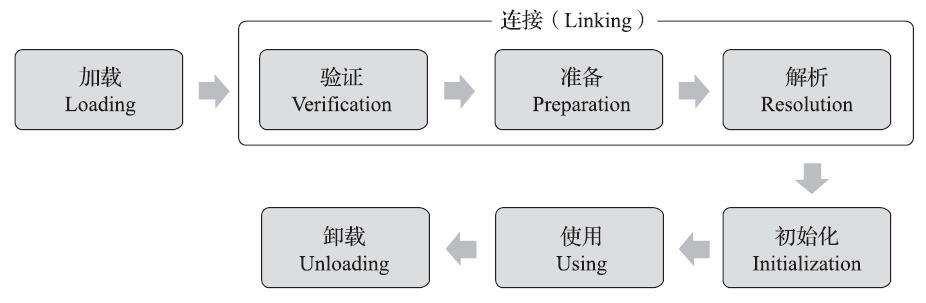
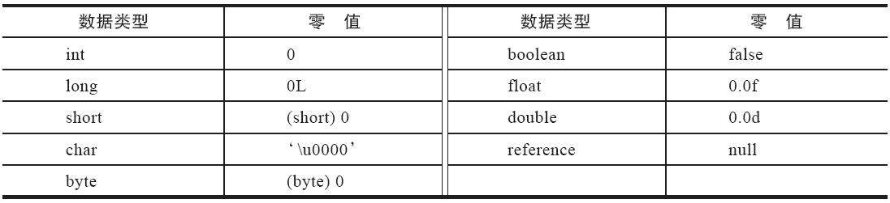
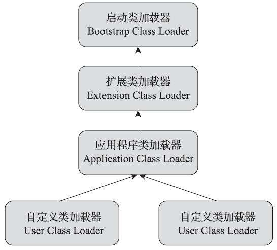

**Java虚拟机把描述类的数据从Class文件加载到内存，并对数据进行校验、转换解析和初始化，最终形成可以被虚拟机直接使用的Java类型，这个过程被称作虚拟机的类加载机制**

## 类加载的时机

一个类从被加载到虚拟机内存中开始，到卸载出内存为止，一共会经历七个阶段：加载、验证、准备、解析、初始化、使用、卸载。其中验证、准备、解析这三个部分统称为连接。

> 加载、验证、准备、初始化和卸载这五个阶段的顺序是确定的，类的加载必须按这个顺序按部就班的开始，只是开始，因为这些阶段都是相交叉的混合执行，会在一个阶段的执行过程中调用、和激活另一个阶段。



关于类何时加载是不确定的，《Java虚拟机规范》中只严格规定了有且只有六种情况必须立即对类进行初始化（加载自然需要在此之前开始）

- new关键字、读取或设置一个类的静态字段时（被final修饰的除外）
- 使用反射调用时，如 `Class.forName()`
- 初始化子类，父类未初始化时，先初始化父类
- 虚拟器启动，初始化`main()`方法的类
-  当使用JDK 7新加入的动态语言支持时，如果一个`java.lang.invoke.MethodHandle`实例最后的解析结果为`REF_getStatic`、`REF_putStatic`、`REF_invokeStatic`、`REF_newInvokeSpecial`四种类型的方法句柄，并且这个方法句柄对应的类没有进行过初始化，则需要先触发其初始化。 
-  当一个接口中定义了`JDK 8`新加入的默认方法（被default关键字修饰的接口方法）时，如果有这个接口的实现类发生了初始化，那该接口要在其之前被初始化。 

## 类加载的过程

1. 加载

   在加载阶段，虚拟机需要完成以下三件事：

   - 通过类的全限定名来获取定义此类的二进制字节流
   - 将这个字节流所代表的静态存储结构转化为方法区的运行时数据结构
   - 在内存中生成一个代表这个类的`java.lang.Class`对象，作为访问这个类在方法区各种数据的入口。

2. 验证

   验证是连接阶段的第一步，这一阶段的目的是确保Class文件的字节流中包含的信息符合《Java虚拟机规范》的全部约束要求，保证这些写信息被当做代码运行后不会危害虚拟机自身的安全。

   - 文件格式验证
   - 元数据验证
   - 字节码验证
   - 符号引用验证

3. 准备

   准备阶段是正式为类中定义的变量（即静态变量，被static修饰的变量，不包活实例变量）分配内存并设置类变量初始值的阶段。初始值通常情况下是数据类型的零值。

   

4. 解析

   解析阶段是Java虚拟机将常量池内的符号应用替换为直接引用的过程

   - 符号引用（Symbolic References）：符号引用以一组符号来描述所引用的目标，符号可以是任何形式的字面量，只要使用时能无歧义地定位到目标即可。符号引用与虚拟机实现的内存布局无关，引用的目标并不一定是已经加载到虚拟机内存当中的内容。各种虚拟机实现的内存布局可以各不相同，但是它们能接受的符号引用必须都是一致的，因为符号引用的字面量形式明确定义在《Java虚拟机规范》的Class文件格式中。

   - 直接引用（Direct References）：直接引用是可以直接指向目标的指针、相对偏移量或者是一个能间接定位到目标的句柄。直接引用是和虚拟机实现的内存布局直接相关的，同一个符号引用在不同虚拟机实例上翻译出来的直接引用一般不会相同。如果有了直接引用，那引用的目标必定已经在虚拟机的内存中存在。

5. 初始化

   初始化阶段是执行类构造器`<clinit>()`方法的过程。

   `<clinit>()`方法是由编译器自动收集类中所有类变量的赋值动作和静态语句块（static{}）块中的语句合并产生的。

## 类加载器

类加载器虽然只用于实现类的加载动作，但它在Java程序中起到的作用却远超类加载阶段。对于任意一个类，都必须由加载它的类加载器和这个类本身一起共同确立其在Java虚拟机中的唯一性，每一个类加载器，都拥有一个独立的类名称空间。这句话可以表达得更通俗一些：比较两个类是否“相等”，只有在这两个类是由同一个类加载器加载的前提下才有意义，否则，即使这两个类来源于同一个Class文件，被同一个Java虚拟机加载，只要加载它们的类加载器不同，那这两个类就必定不相等。

### 双亲委派模型

- 启动类加载器：Bootstrap Class Loader 根据名称加载存放在`JRE_HOME/lib`目录下存放的类库
- 扩展类加载器：Extension Class Loader  加载`JRE_HOME/lib/ext`目录下存放的类库
- 应用类加载器：Application Class Loader 加载`classpath`下的所有类库



双亲委派模型的流程：先检查请求加载的类型是否已经被加载过，若没有则调用父加载器的`loadClass()`方法，若父加载器为空则默认使用启动类加载器作为父加载器。假如父类加载器加载失败，抛出`ClassNotFoundException`异常的话，才调用自己的`findClass()`方法尝试进行加载。

> 这里的父子关系不是通过继承的关系实现的，而是使用组合的关系复用父加载器的代码。

### 破坏双亲委派模型

由于双亲委派模型的核心都是基于`ClassLoader.loadClass()`实现的，所以破坏双亲委派主要是通过继承`ClassLoader`类，重写`loadClass()`方法实现。由于`loadClass()`中需要调用`findClass()`加载我们的Class，而默认实现是空方法，所以我们还要自己实现`findClass()`方法。一个简单的案例如下:

```java
public class MyClassLoaderSample extends ClassLoader {

    private String classPath;

    public MyClassLoaderSample(String classPath) {
        this.classPath = classPath;
    }

    private byte[] loadByte(String name) throws Exception {
        name = name.replaceAll("\\.", "/");
        FileInputStream fis = new FileInputStream(classPath + "/" + name
                + ".class");
        int len = fis.available();
        byte[] data = new byte[len];
        fis.read(data);
        fis.close();
        return data;

    }

    @Override
    protected Class<?> findClass(String name) throws ClassNotFoundException {
        try {
            byte[] data = loadByte(name);
            return defineClass(name, data, 0, data.length);
        } catch (Exception e) {
            e.printStackTrace();
            throw new ClassNotFoundException();
        }
    }

    /**
     * 重写类加载方法，实现自己的加载逻辑，不委派给双亲加载
     *
     * @param name
     * @param resolve
     * @return
     * @throws ClassNotFoundException
     */
    @Override
    protected Class<?> loadClass(String name, boolean resolve)
            throws ClassNotFoundException {
        synchronized (getClassLoadingLock(name)) {
            Class<?> c = findLoadedClass(name);
            if (c == null) {
                try {
                    //先用扩展类加载器加载
                    c = getSystemClassLoader().getParent().loadClass(name);
                } catch (ClassNotFoundException e) {
                }
            }
            if (c == null) {
                //再用自己的类加载器加载
                try {
                    c = findClass(name);
                } catch (ClassNotFoundException e) {
                }
            }
            if (c == null) {
                //加载不到则用系统类加载器加载
                c = getSystemClassLoader().loadClass(name);
            }
            return c;
        }
    }
}
```


