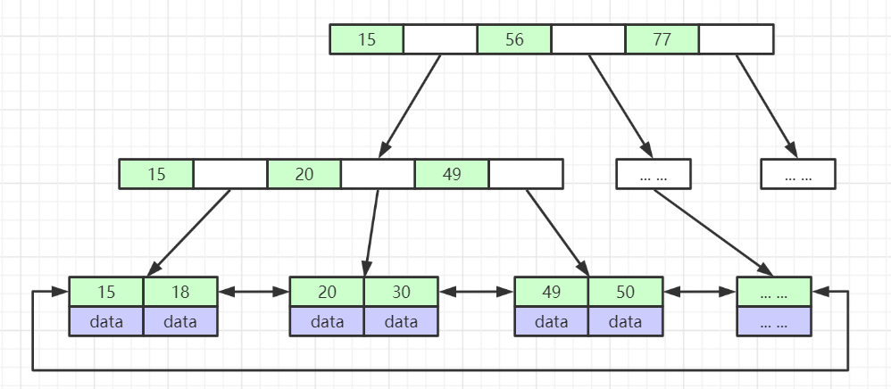
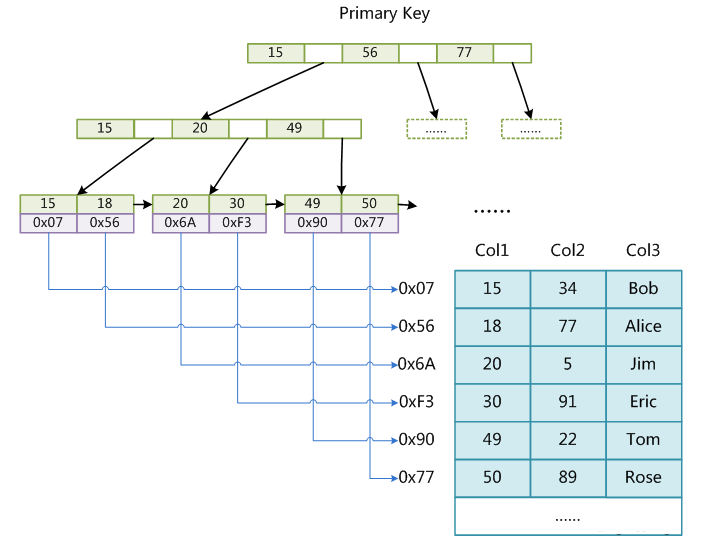
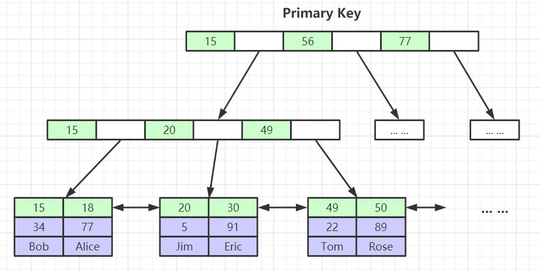
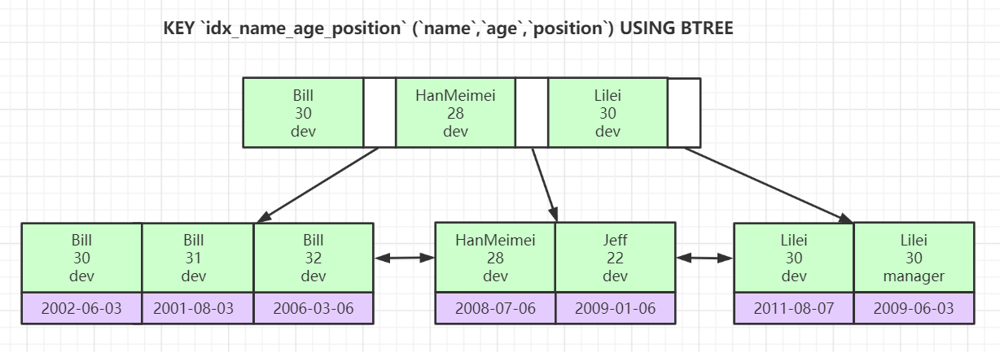

## 索引底层数据结构

mysql 底层有两种数据结构，B+Tree和Hash

### B+Tree

B+树的数据结构已在文章[B+树](https://zijiancode.cn/archives/b树md)详细说明，mysql默认索引使用就是B+Tree，并且在叶子结点做了双向指针的优化



mysql默认设置每个结点的大小为`16kb`，通过以下`sql`可查看：

```sql
SHOW GLOBAL STATUS like 'Innodb_page_size';
```

假设每个非叶子结点中的元素所占空间为8字节，指向子结点所占的空间占4字节，则一个结点可以存储的元素为`16kb/(8b+4b)=1170`个。

假设树的高度为3，叶子结点由于要存储数据，每个元素假设占`1kb`,则叶子结点可以存放的元素为16个，则这样的一棵高度为3的b+树可存储的数据为`1170*1170*16=21907748`个。大约2千万+的一张表使用3次IO便可定位到数据位置。

### Hash

hash索引对索引的key进行一次hash计算就可以定位出数据存储的位置，对于只查询一条数据的情况，要比B+Tree 索引更加高效。但无法支持范围查询。这里个人的思考可以用于用户登录等业务，比较对应用户校验来说，不可能存在范围查询。

## 存储引擎

mysql一般使用两种存储引擎`MyISAM`和`InnoDB`

### `MyISAM`

`MyISAM`存储引擎的索引文件和数据文件是分离的（非聚集）



 索引存在MYI文件中，数据存在MYD文件中。在索引文件中，构建的B+树里，叶子结点存储的是数据的磁盘地址，也就是MYD文件中数据的地址。

### `InnoDB`

`InnoDB`存储引擎的数据文件本身就是B+树组织的一个索引结构文件



叶子结点存储的就是完整的数据记录。

> 对于非主键索引，叶子结点存储的数据是主键。这样可以节省空间和保证一致性。

## 联合索引



查找时匹配顺序为`name` -> `age`->`position`，因为索引是基于`name` -> `age`->`position`的排序构建的。

先匹配`name`字段，匹配到`name`字段后，再匹配`age`字段，匹配到`age`字段后，再匹配`posotion`字段。

若不按照`name` -> `age`->`position`顺序查询，则索引失效。