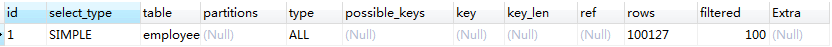
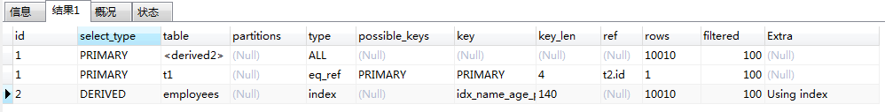
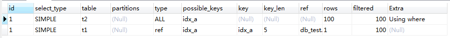
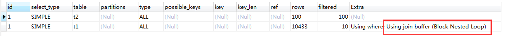
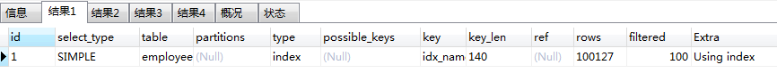

## 分页查询

平常我们的分页查询一般都是使用以下sql实现：

```mysql
EXPLAIN SELECT * FROM employees order by name limit 10000,10;
```



这里看似是从表中查询10条记录，实际上是在表中查询了10010条记录，将10000条记录丢弃所得到的结果，所以我们经常会发现分页查询越到后面查询越慢。

### 优化方式

使用覆盖索引的方式优化。

**注意：这里的优化方式只限于非主键索引，由于主键索引为聚簇索引，并不会存在覆盖索引的情况**

优化后sql如下：

```mysql
EXPLAIN SELECT * FROM employees t1 INNER JOIN (SELECT id from employees ORDER BY `name` limit 10000, 10) t2 ON t1.id = t2.id;
```



优化后我们可以看到，先执行id为2的查询，走的是覆盖索引，这里是远远比上面的全表扫描要快的，再执行第一条查询，这里虽然走的也是ALL，但此时衍生表中只会存在10条数据，扫描时间可以忽略不计，最后执行第二条sql，我们看到这里的索引类型是`eq_ref`，由于我们只有10条数据，所以这里只会有10次的走主键索引的定位时间，总体来看，这里优化后的效率比优化前的效率是大大提高的。


## 关联查询

```mysql
-- 示例表：
CREATE TABLE `t1` (
  `id` int(11) NOT NULL AUTO_INCREMENT,
  `a` int(11) DEFAULT NULL,
  `b` int(11) DEFAULT NULL,
  PRIMARY KEY (`id`),
  KEY `idx_a` (`a`)
) ENGINE=InnoDB DEFAULT CHARSET=utf8;

create table t2 like t1;

-- 插入一些示例数据
-- 往t1表插入1万行记录
drop procedure if exists insert_t1; 
delimiter ;;
create procedure insert_t1()        
begin
  declare i int;                    
  set i=1;                          
  while(i<=10000)do                 
    insert into t1(a,b) values(i,i);  
    set i=i+1;                       
  end while;
end;;
delimiter ;
call insert_t1();

-- 往t2表插入100行记录
drop procedure if exists insert_t2; 
delimiter ;;
create procedure insert_t2()        
begin
  declare i int;                    
  set i=1;                          
  while(i<=100)do                 
    insert into t2(a,b) values(i,i);  
    set i=i+1;                       
  end while;
end;;
delimiter ;
call insert_t2();
```

**注意：t1 和 t2 两个表相同，a字段建了索引，b字段没有索引，t1记录为10000，t2为100**

Mysql的表关联通常有两种算法

- 嵌套循环连接算法（Nested-Loop Join)
- 基于块的嵌套循环连接算法（Block Nested-Loop Join）

### 驱动表与被驱动表

- INNER JOIN：当使用`inner join`时，优化器会优先选择小表作为驱动表，大表为被驱动表。
- LEFT JOIN：左边为驱动表，右边为被驱动表。
- RIGHT JOIN：右边为驱动表，左边为被驱动表。
- 小表：根据过滤条件，过滤完成之后的结果判断，数据量少的就是小表，作为驱动表。

### 嵌套循环连接算法（Nested-Loop Join NLJ)

该算法的流程如下：

1. 取出驱动表的一行记录
2. 取出记录中的关联字段
3. 通过关联字段去被驱动表中取出满足条件的记录，合并结果
4. 重复以上步骤，直到被驱动表的行被读完。

```mysql
EXPLAIN SELECT * FROM t1 INNER JOIN t2 ON t1.a = t2.a;
```



由于t2表比t1表小，所以mysql会使用t2表作为驱动表（可以看到执行计划也是t2先执行），t1表作为被驱动表。t2表使用全表扫描，这里只会扫描100次，而t1表由于走了索引，t2表取出一行记录时，到t1表中查找，只需要一次IO便可以定位到具体行(忽略了索引树的深度)，所以t2表也是扫描了100次，一共便是200次的磁盘扫描。

### 基于块的嵌套循环连接算法（Block Nested-Loop Join BNL）

该算法一般发生于被驱动表关联字段没有索引的情况。

该算法的流程如下：

1. 将驱动表的所有数据加载到join_buffer中
2. 对被驱动表进行逐行扫描，将每行记录与join_buffer中的数据相比对
3. 返回满足条件的行
4. 重复以上步骤，直到扫描完被驱动表

```mysql
EXPLAIN SELECT * FROM t1 INNER JOIN t2 ON t1.b = t2.b;
```



由于b字段没有索引，我们看到Extra显示的是Using join buffer (Block Nested Loop)

在这整个过程中，t2表为驱动表（先执行），t1表为被驱动表，由于需要先将t2表的所有数据加载到join_buffer中，所以这里对t2表全表扫描，扫描100次，再对被驱动表（t1）逐行扫描（全表扫描），将每行记录与join_buffer的数据相比（在内存中进行），最差的情况是比对100次，所以这里一共对t1表扫描次数为10000次，比对次数为100*10000=100万次。总结就是磁盘扫描100+10000=10100次，内存比对次数为100万次。

在本例中，t2表只有100条记录，而join_buffer默认大小为`256k`，若t2表过大，join_buffer放不下时，会采用分段放的方式，即先放一部分t2表的数据，比对完之后，再放另一部分数据。这样产生影响的是在第一部分比对时，需要对t1表进行全表扫描一次，在第二部分比对时，又要对t1表进行全表扫描一次。所以这里通常可以进行提高join_buffer的大小来避免这种情况发生。

### 对于关联查询的优化

- 关联字段加索引，让Mysql尽量使用`NLJ`算法
- 小表驱动大表，使用` straight_join `指定左边的表为驱动表，只适用于`inner join`，一般不建议使用。


## IN 和 EXIST

优化原则：小表驱动大表

 **in：**当B表的数据集小于A表的数据集时，in优于exists  

```mysql
select * from A where id in (select id from B)  
#等价于：
　　for(select id from B){
      select * from A where A.id = B.id
    }
```

 **exists：**当A表的数据集小于B表的数据集时，exists优于in 

 将主查询A的数据，放到子查询B中做条件验证，根据验证结果（true或false）来决定主查询的数据是否保留 

```mysql
select * from A where exists (select 1 from B where B.id = A.id)
#等价于:
    for(select * from A){
      select * from B where B.id = A.id
    }
    
#A表与B表的ID字段应建立索引
```

> 1、EXISTS (subquery)只返回TRUE或FALSE,因此子查询中的SELECT * 也可以用SELECT 1替换,官方说法是实际执行时会忽略SELECT清单,因此没有区别
>
> 2、EXISTS子查询的实际执行过程可能经过了优化而不是我们理解上的逐条对比
>
> 3、EXISTS子查询往往也可以用JOIN来代替，何种最优需要具体问题具体分析


## count 查询

```mysql
-- 关闭mysql查询缓存
set global query_cache_size=0;
set global query_cache_type=0;

EXPLAIN select count(1) from employees;
EXPLAIN select count(id) from employees;
EXPLAIN select count(name) from employees;
EXPLAIN select count(*) from employees;
```



这里只展示一条结果，因为其实这4条结果都是一样的。因为表里面有二级索引，所以这里都是走的二级索引。

下面分析一下具体情况：

在字段有二级索引的情况：count(*)≈count(1)>count(name)>count(id)

> count(字段)统计走二级索引，二级索引存储数据比主键索引少，所以count(字段)>count(id)，其实mysql优化之后count(id)也是走的二级索引 

字段没有二级索引的情况：count(*)≈count(1)>count(id)>count(name)

> 字段没有二级索引，只能做全表扫描，而count(id)还能走主键索引

count(1)跟count(字段)执行过程类似，不过count(1)不需要取出字段统计，就用常量1做统计，count(字段)还需要取出字段，所以理论上count(1)比count(字段)会快一点。

**`count(*) `是例外，mysql并不会把全部字段取出来，而是专门做了优化，不取值，按行累加，效率很高，所以不需要用count(列名)或count(常量)来替代` count(*)`。**

这里附上阿里巴巴开发手册关于count的规约

1. 【强制】 不要使用 count(列名)或 count(常量)来替代 `count(*)`， `count(*)`是 SQL92 定义的标
准统计行数的语法，跟数据库无关，跟 NULL 和非 NULL 无关。
说明： count(*)会统计值为 NULL 的行，而 count(列名)不会统计此列为 NULL 值的行。
2. 【强制】count(distinct col) 计算该列除 NULL 之外的不重复行数，注意 count(distinct col1,
col2) 如果其中一列全为 NULL，那么即使另一列有不同的值，也返回为 0。

> 现在懂了应该用什么统计总行数了吧【滑稽.jpg】

