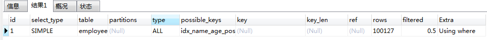
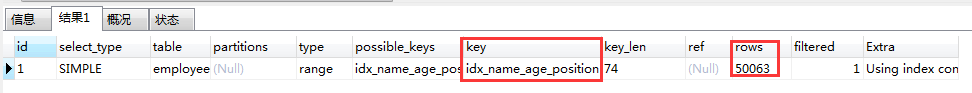
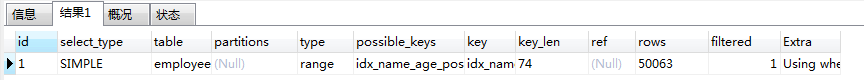
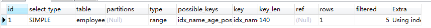

## 实战前的准备

### 创建测试表

```mysql
CREATE TABLE `employees` (
  `id` int(11) NOT NULL AUTO_INCREMENT,
  `name` varchar(24) NOT NULL DEFAULT '' COMMENT '姓名',
  `age` int(11) NOT NULL DEFAULT '0' COMMENT '年龄',
  `position` varchar(20) NOT NULL DEFAULT '' COMMENT '职位',
  `hire_time` timestamp NOT NULL DEFAULT CURRENT_TIMESTAMP COMMENT '入职时\r\n间',
  PRIMARY KEY (`id`),
  KEY `idx_name_age_position` (`name`,`age`,`position`) USING BTREE
) ENGINE=InnoDB AUTO_INCREMENT=7 DEFAULT CHARSET=utf8 COMMENT='员工记录表';
```

### 插入一些数据

```mysql
DROP PROCEDURE IF EXISTS insert_emp;
delimiter;;
CREATE PROCEDURE insert_emp()
BEGIN
	DECLARE i INT;
SET i = 1;
WHILE (i <= 100000) DO
  INSERT INTO employees (NAME, age, position) VALUES (CONCAT('zhangsan', i), i, 'dev');
	SET i = i + 1;
END WHILE;
END;;
delimiter;

CALL insert_emp ();
```

## 开始实战

### 案列

1. 联合索引第一个字段用范围不会走索引的情况

   ```mysql
   EXPLAIN SELECT * FROM employees WHERE name > 'LiLei' AND age = 22 AND position ='manager';
   ```

   

   > 一般来说，这种情况是会走第一个索引的，对于这种情况，是由于这张表后续10w行zhangsan开头的数据，结果集很大，回表效率不高，全表扫描效率还要更高一些 

2. 强制走索引

   ```mysql
   EXPLAIN SELECT * FROM employees force index(idx_name_age_position) WHERE name > 'LiLei' AND age = 22 AND position ='manager';
   ```

   

   > 此时让mysql强制使用索引，我们发现rows扫描行数好像大大减少了。那是不是效率提高了呢？不一定，因为走的是二级索引，查的是全字段，会有回表的情况，那么我们来对比一下效率吧。

   ```mysql
   ‐-- 关闭查询缓存
   set global query_cache_size=0;
   set global query_cache_type=0;
   SELECT * FROM employees WHERE name > 'LiLei';
   -- 执行时间0.238s
   
   SELECT * FROM employees force index(idx_name_age_position) WHERE name > 'LiLei';
   -- 执行时间0.388s
   ```

   > 我们发现强制走索引确实比全表扫描更慢，这里我把后面age和position条件去掉是因为加上这两个条件我的表里是没有数据的，自然不可能发生回表操作，测试也没有意义了。

3.  覆盖索引优化

   ```mysql
   EXPLAIN SELECT name,age,position from employees where name > 'LiLei' AND age = 22 AND position ='manager';
   ```

   

4. in和or在表数据量比较大的情况会走索引，在表记录不多的情况下会选择全表扫描

   ```mysql
   -- 会走索引
   EXPLAIN SELECT * from employees where name in  ('LiLei','zhangsan') AND age = 22 AND position ='manager';
   -- 不走索引
   EXPLAIN SELECT * from employees_copy where name in  ('LiLei','zhangsan') AND age = 22 AND position ='manager';
   ```

   > 因为在数据量较小的情况下，与走二级索引，走完再回表这种情况相比，不如直接全表扫聚簇索引成本更低一些。

5.  like KK%不管表数据量大小都会走索引

   ```mysql
   EXPLAIN SELECT * from employees where name like  'LiLei%' AND age = 22 AND position ='manager';
   ```

   

   ```mysql
   EXPLAIN SELECT * from employees_copy where name like  'LiLei%' AND age = 22 AND position ='manager';
   ```

   

   > 我们知道like%也算是一种范围查询，对于范围查询，后续的字段是无序的，可是这里为什么就匹配了所有的索引呢？

### 索引下推

对于辅助的联合索引(name,age,position)，正常情况按照最左前缀原则，`SELECT * FROM employees WHERE name like 'LiLei%' AND age = 22 AND position ='manager'` 这种情况只会走name字段索引，因为根据name字段过滤完，得到的索引行里的`age`和`position`是无序的，无法很好的利用索引。 

在MySQL5.6之前的版本，这个查询只能在联合索引里匹配到名字是 **'LiLei' 开头**的索引，然后拿这些索引对应的主键逐个回表，到主键索引上找出相应的记录，再比对**age**和**position**这两个字段的值是否符合。 

MySQL 5.6引入了索引下推优化，可以在索引遍历过程中，对索引中包含的所有字段先做判断，过滤掉不符合条件的记录之后再回表，可以有效的减少回表次数**。使用了索引下推优化后，上面那个查询在联合索引里匹配到名字是 'LiLei' 开头**的索引之后，同时还会在索引里过滤`age`和`position`这两个字段，拿着过滤完剩下的索引对应的主键id再回表查整行数据。 

索引下推会减少回表次数，对于innodb引擎的表索引下推只能用于二级索引，innodb的主键索引（聚簇索引）树叶子节点上保存的是全行数据，所以这个时候索引下推并不会起到减少查询全行数据的效果。

### Mysql如何选择合适的索引

```mysql
EXPLAIN SELECT * FROM employees WHERE name > 'a';
```

对于这条sql，结合上面的例子，我们肯定是知道不会走索引的，那我们就来分析一些为什么吧。

**使用trace工具分析索引使用情况**，用完记得关闭。

```mysql
set session optimizer_trace="enabled=on",end_markers_in_json=on;-- 开启trace
select * from employees where name > 'LiLei';
SELECT * FROM information_schema.OPTIMIZER_TRACE;


{
  "steps": [
    {
      "join_preparation": {  -- 第一阶段：SQL准备阶段，格式化sql
        "select#": 1,
        "steps": [
          {
            "expanded_query": "/* select#1 */ select `employees`.`id` AS `id`,`employees`.`name` AS `name`,`employees`.`age` AS `age`,`employees`.`position` AS `position`,`employees`.`hire_time` AS `hire_time` from `employees` where (`employees`.`name` > 'LiLei')"
          }
        ] /* steps */
      } /* join_preparation */
    },
    {
      "join_optimization": {  -- 第二阶段：SQL优化阶段
        "select#": 1,
        "steps": [
          {
            "condition_processing": { -- 条件处理
              "condition": "WHERE",
              "original_condition": "(`employees`.`name` > 'LiLei')",
              "steps": [
                {
                  "transformation": "equality_propagation",
                  "resulting_condition": "(`employees`.`name` > 'LiLei')"
                },
                {
                  "transformation": "constant_propagation",
                  "resulting_condition": "(`employees`.`name` > 'LiLei')"
                },
                {
                  "transformation": "trivial_condition_removal",
                  "resulting_condition": "(`employees`.`name` > 'LiLei')"
                }
              ] /* steps */
            } /* condition_processing */
          },
          {
            "substitute_generated_columns": {
            } /* substitute_generated_columns */
          },
          {
            "table_dependencies": [  -- 表依赖详情
              {
                "table": "`employees`",
                "row_may_be_null": false,
                "map_bit": 0,
                "depends_on_map_bits": [
                ] /* depends_on_map_bits */
              }
            ] /* table_dependencies */
          },
          {
            "ref_optimizer_key_uses": [
            ] /* ref_optimizer_key_uses */
          },
          {
            "rows_estimation": [  -- 预估表的访问成本
              {
                "table": "`employees`",
                "range_analysis": {
                  "table_scan": {  -- 全部扫描情况
                    "rows": 100127, -- 扫描行数
                    "cost": 20380  -- 查询成本
                  } /* table_scan */,
                  "potential_range_indexes": [  -- 查询可能使用的索引
                    {
                      "index": "PRIMARY",  -- 主键索引
                      "usable": false,
                      "cause": "not_applicable"
                    },
                    {
                      "index": "idx_name_age_position",  -- 辅助索引
                      "usable": true,
                      "key_parts": [
                        "name",
                        "age",
                        "position",
                        "id"
                      ] /* key_parts */
                    }
                  ] /* potential_range_indexes */,
                  "setup_range_conditions": [
                  ] /* setup_range_conditions */,
                  "group_index_range": {
                    "chosen": false,
                    "cause": "not_group_by_or_distinct"
                  } /* group_index_range */,
                  "analyzing_range_alternatives": {  -- 分析各个索引使用成本
                    "range_scan_alternatives": [
                      {
                        "index": "idx_name_age_position",
                        "ranges": [
                          "LiLei < name"  -- 索引使用范围
                        ] /* ranges */,
                        "index_dives_for_eq_ranges": true,
                        "rowid_ordered": false,  -- 使用该索引获取的记录是否按照主键排序
                        "using_mrr": false,  
                        "index_only": false,  -- 是否使用覆盖索引
                        "rows": 50063,  -- 索引扫描行数
                        "cost": 60077,  -- 索引查询成本
                        "chosen": false, -- 是否选择
                        "cause": "cost"
                      }
                    ] /* range_scan_alternatives */,
                    "analyzing_roworder_intersect": {
                      "usable": false,
                      "cause": "too_few_roworder_scans"
                    } /* analyzing_roworder_intersect */
                  } /* analyzing_range_alternatives */
                } /* range_analysis */
              }
            ] /* rows_estimation */
          },
          {
            "considered_execution_plans": [
              {
                "plan_prefix": [
                ] /* plan_prefix */,
                "table": "`employees`",
                "best_access_path": {  -- 最优访问路径
                  "considered_access_paths": [ -- 最终选择的访问路径
                    {
                      "rows_to_scan": 100127,
                      "access_type": "scan",  -- 全表扫描
                      "resulting_rows": 100127,
                      "cost": 20378,
                      "chosen": true
                    }
                  ] /* considered_access_paths */
                } /* best_access_path */,
                "condition_filtering_pct": 100,
                "rows_for_plan": 100127,
                "cost_for_plan": 20378,
                "chosen": true
              }
            ] /* considered_execution_plans */
          },
          {
            "attaching_conditions_to_tables": {
              "original_condition": "(`employees`.`name` > 'LiLei')",
              "attached_conditions_computation": [
              ] /* attached_conditions_computation */,
              "attached_conditions_summary": [
                {
                  "table": "`employees`",
                  "attached": "(`employees`.`name` > 'LiLei')"
                }
              ] /* attached_conditions_summary */
            } /* attaching_conditions_to_tables */
          },
          {
            "refine_plan": [
              {
                "table": "`employees`"
              }
            ] /* refine_plan */
          }
        ] /* steps */
      } /* join_optimization */
    },
    {
      "join_execution": {
        "select#": 1,
        "steps": [
        ] /* steps */
      } /* join_execution */
    }
  ] /* steps */
}
```

> 全表扫描的成本低于索引扫描，所以mysql最终选择全表扫描

``` mysql
set session optimizer_trace="enabled=off"; -- 关闭trace
```

## 常见sql深入优化

### Order By 与 Group By 优化

order by的优化也同样需要遵循最左前缀原则

```mysql
EXPLAIN SELECT * FROM employees where name = 'LiLei' and position = 'dev' ORDER BY age;
-- 索引树排序，在name匹配的情况下，age列是有序的

EXPLAIN SELECT * FROM employees where name = 'LiLei' ORDER BY position;
-- filesort排序，只有name一个字段匹配的情况下，未走age索引，position字段并非有序

EXPLAIN SELECT * FROM employees where name = 'LiLei' ORDER BY age,position;
-- 索引树排序

EXPLAIN SELECT * FROM employees where name = 'LiLei' ORDER BY position,age;
-- filesort排序，由于先使用position排序，而只有name匹配的情况，position并未有序

EXPLAIN SELECT * FROM employees where name = 'LiLei' AND age = 22 ORDER BY position,age;
-- 索引树排序，虽然先使用position排序，但已匹配age字段，position有序，后面的age排序由于age此时为常量22，不需排序

EXPLAIN SELECT * FROM employees where name = 'LiLei' AND age in (22,23) ORDER BY position;
-- filesort排序，在字段为in条件的情况，后面查出来的结果集不再有序

EXPLAIN SELECT * FROM employees where name = 'LiLei' ORDER BY age,position desc;
-- filesort排序，desc为降序排序，索引树的排序为升序，排序方式不同，无法使用索引树。
```

总结：

 1. MySQL支持两种方式的排序filesort和index，Using index是指MySQL扫描索引本身完成排序。index效率高，filesort效率低。

 2. order by满足两种情况会使用Using index。 

    1) order by语句使用索引最左前列。 

    2) 使用where子句与order by子句条件列组合满足索引最左前列。 

	3. 尽量在索引列上完成排序，遵循索引建立（索引创建的顺序）时的最左前缀法则。

	4. 如果order by的条件不在索引列上，就会产生Using filesort。

	5. 能用覆盖索引尽量用覆盖索引

	6. group by与order by很类似，其实质是先排序后分组，遵照索引创建顺序的最左前缀法则。对于group by的优化如果不需要排序的可以加上**order by null禁止排序**。注意，where高于having，能写在where中的限定条件就不要去having限定了

### **Using filesort文件排序原理详解**

filesort文件排序方式

- 单路排序：一次性取出满足条件行的所有字段，然后再sort_buffer中进行排序，排序好的结果就是完整的结果集了，用trace工具可以看到sort_mode信息里显示< sort_key, additional_fields>或者<sort_key,packed_additional_fields > 
- 双路排序（回表排序）：取出主键id和需要排序的字段加载到sort_buffer中进行排序，排序好后再通过id去表中取回条件行中其他的所需字段，组合起来才是完整的结果集。用trace工具可以看到sort_mode信息里显示< sort_key, rowid > 

MySQL 通过比较系统变量 max_length_for_sort_data(**默认1024字节**) 的大小和需要查询的字段总大小来判断使用哪种排序模式。 

- 如果字段的总长度小于max_length_for_sort_data ，那么使用单路排序模式。

- 如果字段的总长度大于max_length_for_sort_data ，那么使用双路排序模式。

```mysql
set session optimizer_trace="enabled=on",end_markers_in_json=on;-- 开启trace
SELECT * FROM employees where name = 'LiLei' ORDER BY age,position desc;
SELECT * FROM information_schema.OPTIMIZER_TRACE;

 
			 "filesort_information": [
              {
                "direction": "asc",
                "table": "`employees`",
                "field": "age"
              },
              {
                "direction": "desc",
                "table": "`employees`",
                "field": "position"
              }
            ] /* filesort_information */,
            "filesort_priority_queue_optimization": {
              "usable": false,
              "cause": "not applicable (no LIMIT)"
            } /* filesort_priority_queue_optimization */,
            "filesort_execution": [
            ] /* filesort_execution */,
            "filesort_summary": {  -- 文件排序信息
              "rows": 1, -- 预计扫描行数
              "examined_rows": 1, -- 排序参与的行数
              "number_of_tmp_files": 0, -- 使用临时文件的个数，这个值如果为0代表全部使用的sort_buffer内存排序，否则使用的磁盘文件排序
              "sort_buffer_size": 262000,  -- 排序缓存的大小，单位Byte
              "sort_mode": "<sort_key, packed_additional_fields>" -- 排序方式，单路排序
            } /* filesort_summary */
          }
```

其实对比两个排序模式，单路排序会把所有需要查询的字段都放到 sort buffer 中，而双路排序只会把主键和需要排序的字段放到 sort buffer 中进行排序，然后再通过主键回到原表查询需要的字段。

如果 MySQL **排序内存** **sort_buffer** 配置的比较小并且没有条件继续增加了，可以适当max_length_for_sort_data 配置小点，让优化器选择使用**双路排序**算法，可以在sort_buffer 中一次排序更 多的行，只是需要再根据主键回到原表取数据。 

如果 MySQL 排序内存有条件可以配置比较大，可以适当增大 max_length_for_sort_data 的值，让优化器优先选择全字段排序(**单路排序**)，把需要的字段放到 sort_buffer 中，这样排序后就会直接从内存里返回查询结果了。 

所以，MySQL通过 **max_length_for_sort_data** 这个参数来控制排序，在不同场景使用不同的排序模式，从而提升排序效率。 

**注意**，如果全部使用sort_buffer内存排序一般情况下效率会高于磁盘文件排序，但不能因为这个就随便增大sort_buffer(默认1M)，mysql很多参数设置都是做过优化的，不要轻易调整。 

### 索引设计原则

**1、代码先行，索引后上** 

等到主体业务功能开发完毕，把涉及到该表相关sql都要拿出来分析之后再建立索引。 

**2、联合索引尽量覆盖条件** 

比如可以设计一个或者两三个联合索引(尽量少建单值索引)，让每一个联合索引都尽量去包含sql语句里的where、order by、group by的字段，还要确保这些联合索引的字段顺序尽量满足sql查询的最左前缀原则。

**3、不要在小基数字段上建立索引** 

索引基数是指这个字段在表里总共有多少个不同的值，比如一张表总共100万行记录，其中有个性别字段， 其值不是男就是女，那么该字段的基数就是2。 如果对这种小基数字段建立索引的话，还不如全表扫描了，因为你的索引树里就包含男和女两种值，根本没 法进行快速的二分查找，那用索引就没有太大的意义了。 

一般建立索引，尽量使用那些基数比较大的字段，就是值比较多的字段，那么才能发挥出B+树快速二分查找的优势来。 

**4、长字符串我们可以采用前缀索引** 

尽量对字段类型较小的列设计索引，比如说什么tinyint之类的，因为字段类型较小的话，占用磁盘空间也会比较小，此时你在搜索的时候性能也会比较好一点。当然，这个所谓的字段类型小一点的列，也不是绝对的，很多时候你就是要针对varchar(255)这种字段建立 索引，哪怕多占用一些磁盘空间也是有必要的。 对于这种varchar(255)的大字段可能会比较占用磁盘空间，可以稍微优化下，比如针对这个字段的前20个 字符建立索引，就是说，对这个字段里的每个值的前20个字符放在索引树里，类似于 KEY index(name(20),age,position)。 

此时你在where条件里搜索的时候，如果是根据name字段来搜索，那么此时就会先到索引树里根据name字段的前20个字符去搜索，定位到之后前20个字符的前缀匹配的部分数据之后，再回到聚簇索引提取出来完整的name字段值进行比对。 

但是假如你要是order by name，那么此时你的name因为在索引树里仅仅包含了前20个字符，所以这个排序是没法用上索引的， group by也是同理。

**5、where与order by冲突时优先where** 

在where和order by出现索引设计冲突时，到底是针对where去设计索引，还是针对order by设计索引？到底是让where去用上索引，还是让order by用上索引?一般这种时候往往都是让where条件去使用索引来快速筛选出来一部分指定的数据，接着再进行排序。 

因为大多数情况基于索引进行where筛选往往可以最快速度筛选出你要的少部分数据，然后做排序的成本可能会小很多。 

**6、基于慢sql查询做优化** 

可以根据监控后台的一些慢sql，针对这些慢sql查询做特定的索引优化，参考链接[mysql慢查询]( https://blog.csdn.net/qq_40884473/article/details/89455740 )